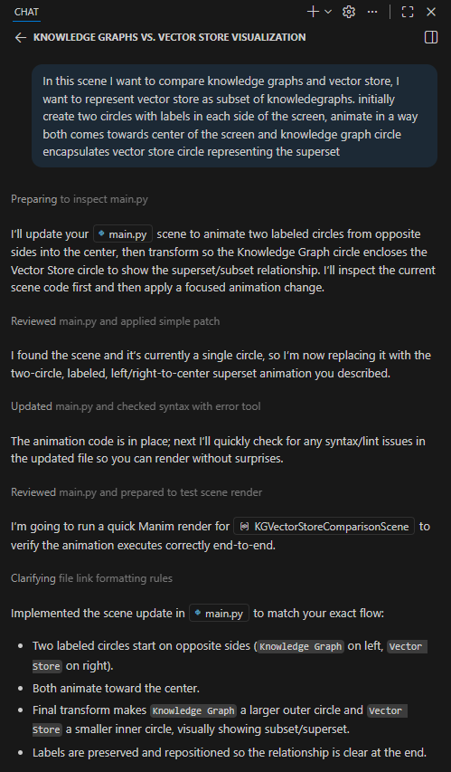
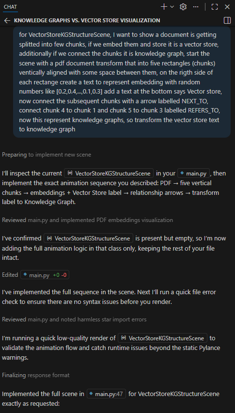
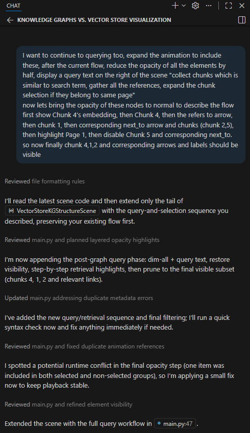

## Vibe-Coding manim animations

I have used github copilot with `gpt-5.3-codex` to generate around 80% of the code for this animation.
here are few observations on what worked and what didn't
 - simple prompts with vague requirements gives a gap between expected vs generated animation, so explain each scene in detail such as where objects should be placed and how they move resolved most of the problems
 - since `from manim import *` is a common pattern, copilot tries to fix unwanted linting issues, ignoring the rule in `pyproject.toml` helps
 - planning the scene for 5-10 mins before prompting helps to give clear instruction

## Sample Conversation

